# Complex Plotter

While working through the coursera module [Introduction to Complex Analysis](https://www.coursera.org/learn/complex-analysis/home/welcome) I wanted to develop a robust MATLAB class that allows me to visualize and gain intuition for complex valued functions. 

The comp.plotter class is the result of this ambition.

## Version 1.2

Version 1.2 introduces the functionality to plot julia sets for functions of the form f(z) = z^2 + c. With this release, I learned how to work with images in MATLAB and how to export graphics to gifs.

We call the static function "julia" to display the julia set.

```MATLAB

c = i;
comp.plotter.julia(c) % Plot the julia set of f(z) = z^2 + i

```

| C | -0.4 + 0.6i | 0.285 + 0.01i | -0.835 - 0.2321i | -0.8 + 0.156i |
| --- | --- | --- | --- | --- |
| Julia Set | 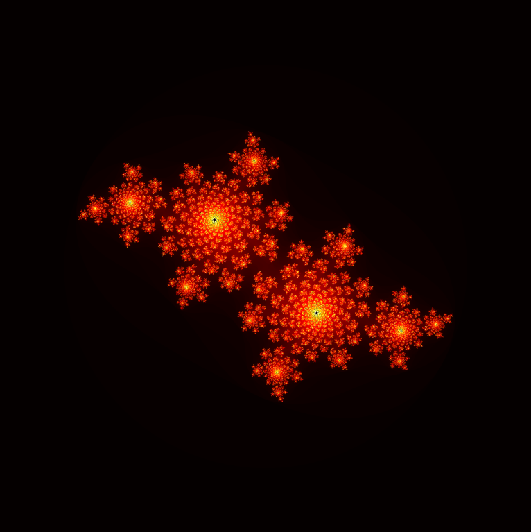 |  | 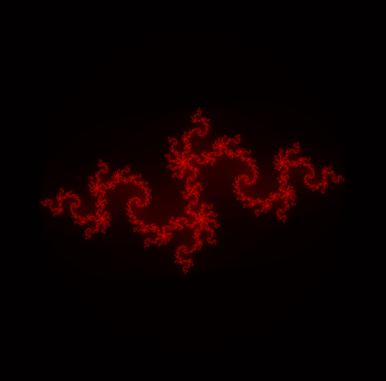 | 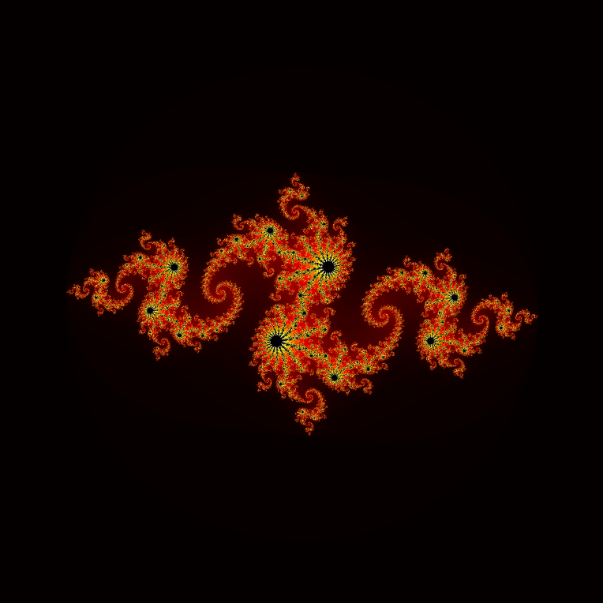 |

Specific values of C were taken from the [Julia Set](https://en.wikipedia.org/wiki/Julia_set) wikipedia. I love the contrast of red and black so I plotted the julia sets using the 'hot' colormap.

What I'm most proud of is the following gif. This can be created using the juliaToGIF static function.

```MATLAB

numSteps = 100 % number of frames in the .gif
duration = 5 % Duration in seconds

comp.plotter(numSteps, duration);

```


This gif was inspired by [this](https://en.wikipedia.org/wiki/Julia_set#/media/File:JSr07885.gif) fantastic visualization.


To instantiate a plotter class, we simply pass a function handle to the constructor. The function handle can be defined or anonymous, there is no difference.

```MATLAB   

my_fun = @(z) z^4 + 10;
p = comp.plotter(my_fun) % Equivalent to p = comp.plotter(@(z) z^4 + 10) 

```
Upon object creation, a series of plots will automatically be generated. Let's examine them.

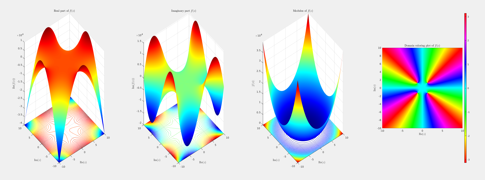

In order to visualize complex valued functions, we put the real part of z on the x-axis and the imag part on the y-axis.
The first plot then maps the real part of f(z) to the z-axis. The second plot maps the imaginary part of f(z) to the z-axis. The third plot maps the modulus of f(z) to the z-axis. The fourth plot is the most unique - it is a domain coloring plot where the arg of f(z) is mapped to hsv values. We can use the domain coloring plot to quickly - visually - locate the zeros of our function. 

The default domain of f(z) is a 100 x 100 meshed grid whose real and imaginary bounds are from -10 to 10. Let's use the *zoom* function to get a closer look at the function's behavior near the zeros. We can see from the domain coloring plot that the zeros are within +-2 +- 2

```MATLAB   

p.zoom(2) % The zoom function sets the new min and max bounds to the argument passed

```

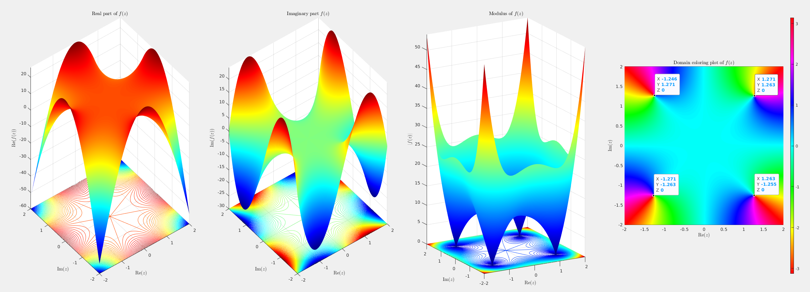

We can see from the third plot where the modulus collapses to zero. These are the roots. While I have yet to implement a numerically precise way to find the zeros, we can get a rough estimate by selecting points in the domain coloring plot.

We can change the function by setting the *f* attribute of the plotter class. Doing so will automatically recalculate the output of the function. If we would like to see the same set of 4 plots, we call the plot3 function.

```MATLAB  

p.f = @(z) z^i;
p.plot3;

```
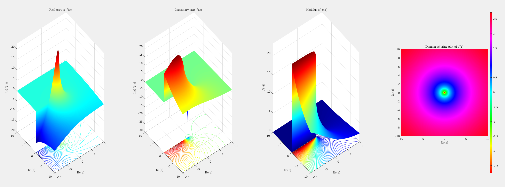 

Funky!

Another type of plot that the comp.plotter class offers is a plot of intersecting surfaces, called using the surf function. This plot is really just a combination of the first two plots from plot3 merged into a single axis. We can see how the imaginary and real parts of the output dance together.

```MATLAB 

p.f = 1/z;
p.surf;

```

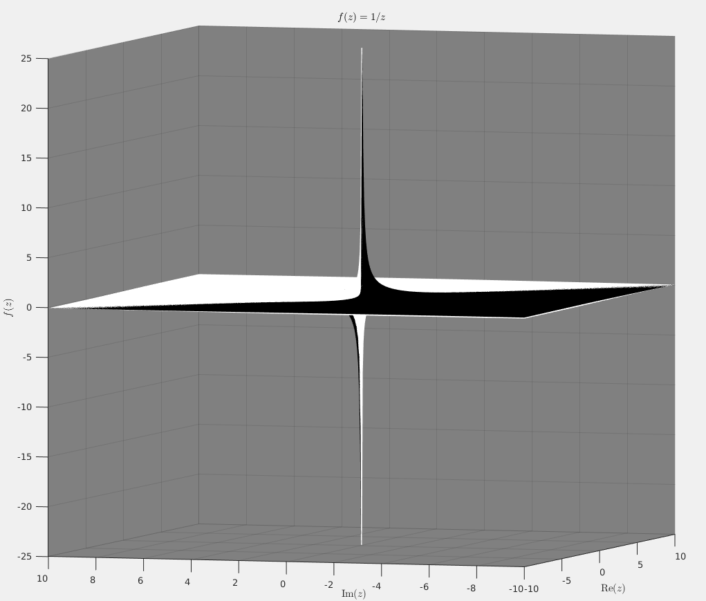

The comp.plotter has two static functions to build intuiton for how "fundamental" (according to me, anyways) functions appear in the complex world.

```MATLAB

comp.plotter.trig; % Plot complex valued trig functions

```

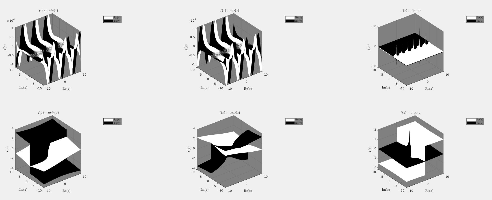

```MATLAB
comp.plotter.poly; % Plot complex valued polynomials
```

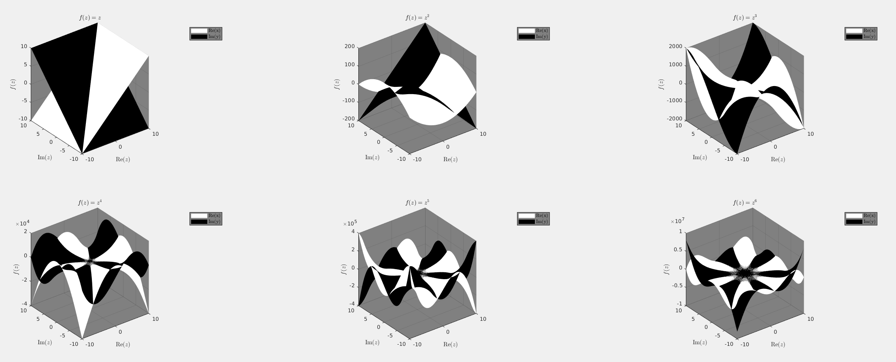

The compl.plotter class also has a limit function that implements the formal definition of a limit. Take for example the following trivial problem:

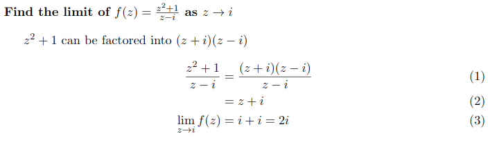

Let's check the comp.plotter function:

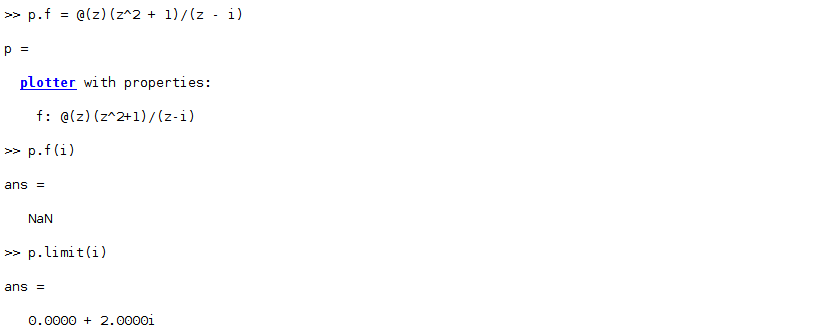

That's all I have for now, but I'd like to add more functionality as I progress through the course.

Some ideas for the future:

* zeros - a function that calculates the zeros of f(z) within epsilon
* julia - I haven't learned how to find the julia set yet, but maybe it is possible to implement it in MATLAB
* mandelbrot - A classic. Draw the mandelbrot set
